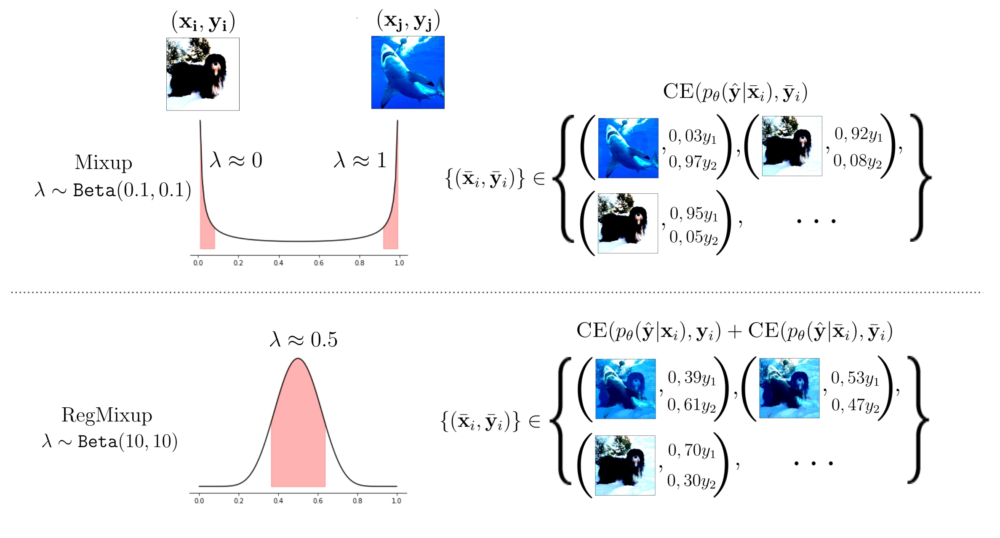

# RegMixup
Official implementation of "RegMixup: Mixup as a Regularizer Can Surprisingly
Improve Accuracy and Out Distribution Robustness"



RegMixup is a simple regulariser that adds to the cross-entropy loss a mixup loss term computed on samples with an interpolation factor close to 0,5.
RegMixup trained networks exhibit high entropy barriers between class clusters and are more robust to several forms of covariate shift.
RegMixup provides remarkably improved accuracy and calibration for both in-domain and covariate shift test sets and preserves or improves out-of-distribution detection performance. 

# Using RegMixup in your codebase

Define the mixing function as in the original Mixup paper:
```
import torch
import numpy as np

def mixup_data(x, y, alpha=1.0, beta=1.0):
    if alpha > 0 and beta > 0:
        lam = np.random.beta(alpha, beta)
    else:
        lam = 1 #cross-entropy

    batch_size = x.size()[0]
    index = torch.randperm(batch_size).cuda()
    mixed_x = lam * x + (1 - lam) * x[index] 
    y_a, y_b = y, y[index]
    return mixed_x, y_a, y_b, lam
```

Define the RegMixup loss and then modify the training loop:
```
def regmixup_criterion(criterion, pred, y_a, y_b, lam):
    return lam * criterion(pred, y_a) + (1 - lam) * criterion(pred, y_b)

...

import torch.nn.functional as F

for batch in train_loader:

    x, y = batch
    mixup_x, part_y_a, part_y_b, lam = mixup_data(x, y, mixup_alpha, mixup_beta)
    
    #since y is present in the first part of both targets_a and targets_b
    #The loss computed only on that part of the tensor is equivalent to 
    #the cross-entropy loss.
    targets_a = torch.cat([y, part_y_a])
    targets_b = torch.cat([y,part_y_b])
    x = torch.cat([x, mixup_x], dim=0)
    
    logits, embeddings = model(x)
    loss = self.loss(F.cross_entropy, logits, targets_a,targets_b, lam)
    ...
```
# Setup
Clone the repository using git.

To setup the environment, you can use the `environment.yml` file in the main folder. 
Modify the last line of the file to set the prefix variable to the path of your anaconda installation folder. 
For instance `prefix: /home/anaconda3/envs/regmixup`. Then run the command 

```
conda env create -f environment.yml
```
To activate the environment run:
```
conda activate regmixup
```

To evaluate on the CIFAR-C, CIFAR-10.1 and CIFAR-10.2 you need to download them manually and extract them where appropriate. The default dataset
location is assumed to be the `../data/` folder (that will be created automatically), you can modify this setting by changing the 
argument `--dataset_directory` to the desired value.

These datasets can be downloaded at the following links:
- [CIFAR-10-C](https://zenodo.org/record/2535967#.Yg-2v1vP3mE/)
- [CIFAR-100-C](https://zenodo.org/record/3555552#.Yg-2v1vP3mE/)
- [CIFAR-10.1, choose v6 as per authors recommendation](https://github.com/modestyachts/CIFAR-10.1/)
- [CIFAR-10.2](https://github.com/modestyachts/cifar-10.2/)

# Train and evaluate

The file `commands.sh` contains the commands required to run cross-entropy training and RegMixup training and evaluation with default values to reproduce the results of our paper.

The file `experiment_setup.py` contains most of the arguments you might want to modify. Any model-specific arguments are defined in the method `add_model_specific_args` of each model.

The results will be saved in the `results` subfolder of the `--default_root_dir` in `.json` format. 
# The codebase design
The codebase uses `pytorch-lightning` and dynamic inheritance to make the code-base easy to extend while keeping the design
as modular and reusable as possible. 

The dynamic inheritance is impemented by creating a local class within a method that receives as a parameter the class to extend and returning the dynamically created class. An example of this pattern can be seen in `models/regmixup.py`.
This allows to keep the RegMixup implementation compact and to re-use all the code used in standard cross-entropy training as much as possible (specified in the `models/vanilla.py` file), but also to combine it with any other technique.

The file `ood_evaluable_module.py` implements all the code required to evaluate the 
accuracy and calibration on clean and data-shifted inputs. It also contains the code to perform out-of-distribution detection experiments. 
To evaluate a model, make it extend this base class, and it will automatically inherit all the evaluation methods. 

An example of how to use this inheritance hierarchy is given in `utils/experiment_setup.py` and `train.py`-

# Cite our work


If you find this repository useful, please cite our work as follows:
```
@inproceedings{
pinto2022RegMixup,
title={RegMixup: Mixup as a Regularizer Can Surprisingly
Improve Accuracy and Out Distribution Robustness},
author={Francesco Pinto and Harry Yang and Ser-Nam Lim and Philip Torr and Puneet K. Dokania},
year={2022},
booktitle = {Advances in Neural Information Processing Systems},

}
```
